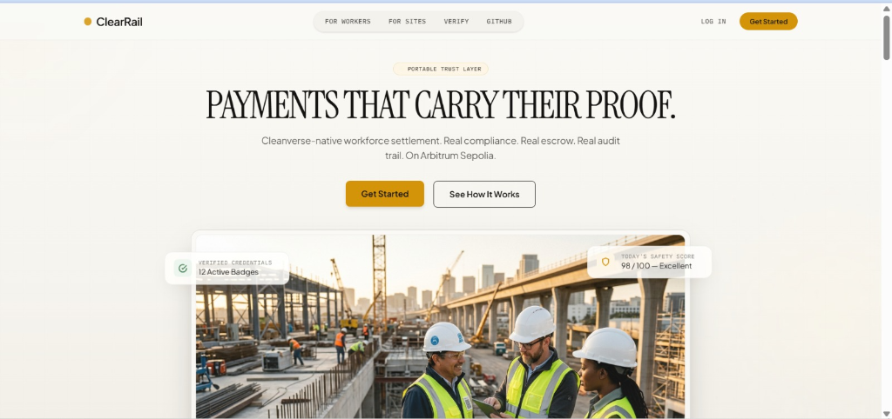
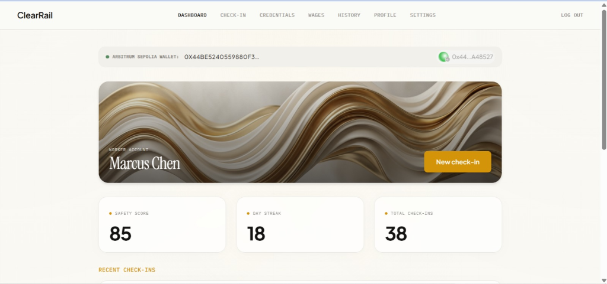
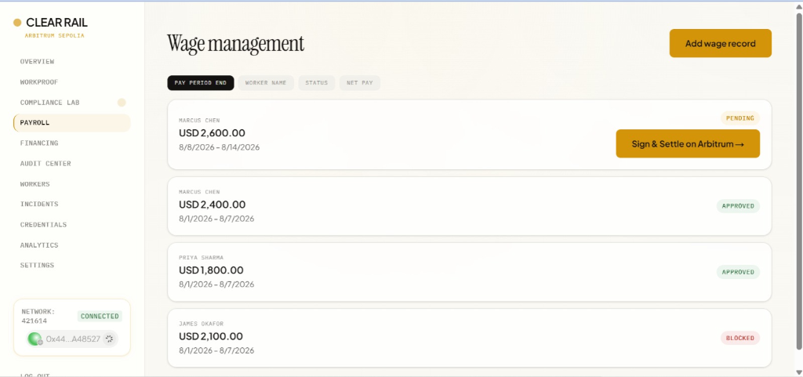
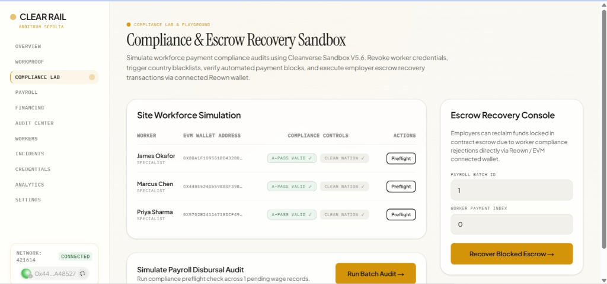
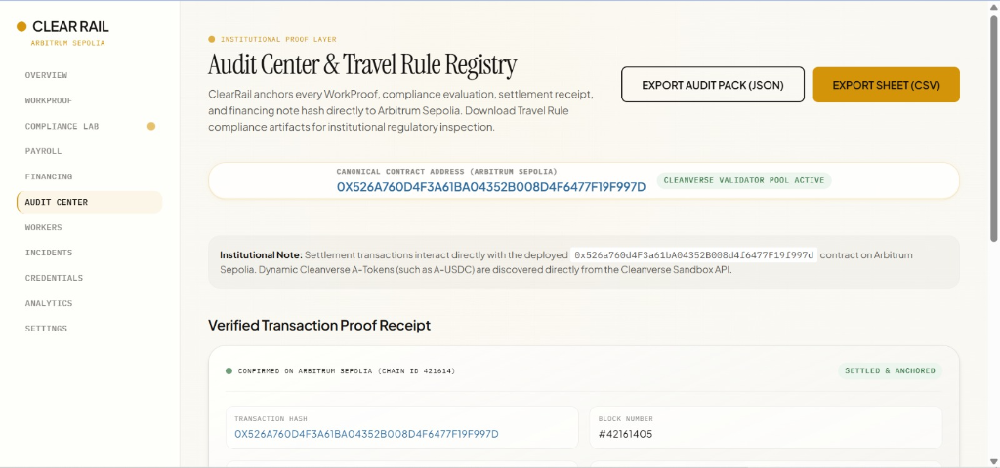
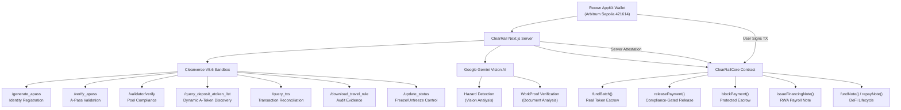
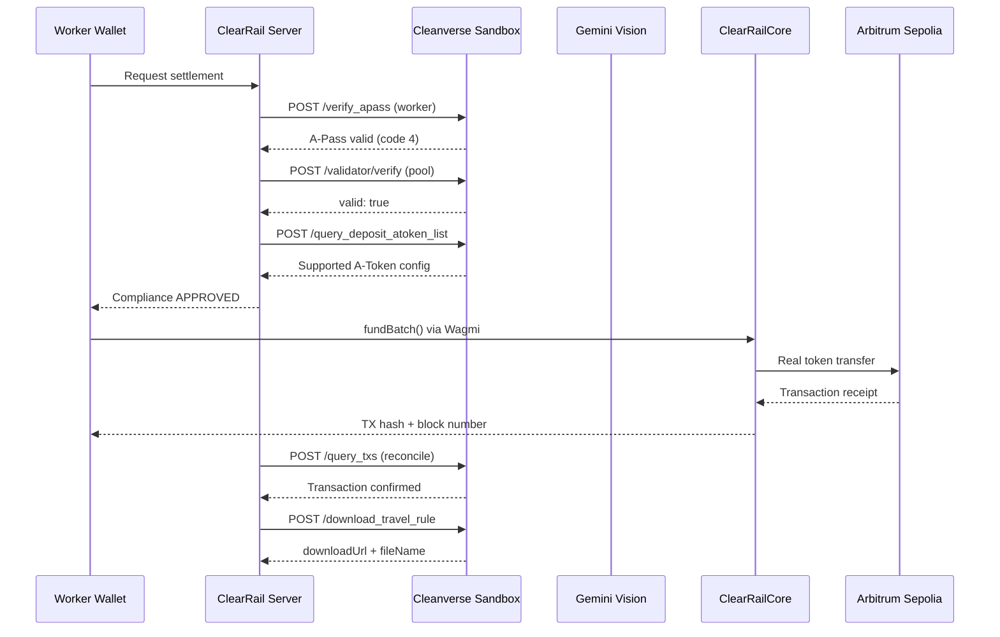

# ClearRail



<p align="center">
  <strong>Verified work. Clean money. Programmable settlement.</strong>
</p>

<p align="center">
  
  
  
  
  
  
</p>

### Live Project Resources

| Resource | Link |
|---|---|
| **Live Web App** | [ClearRail Live Portal](https://cairn-theta-seven.vercel.app/) |
| **GitHub Repository** | [Cairn-ClearRail GitHub Repository](https://github.com/Cairn-ClearRail/ClearRail) |
| **ClearRailCore Smart Contract** | [`0x526a760d4F3a61bA04352B008d4f6477F19f997d`](https://sepolia.arbiscan.io/address/0x526a760d4F3a61bA04352B008d4f6477F19f997d) |
| **ClearRail Testnet A-USDC (ERC-20 settlement token)** | [`0x3CFA584B9149D34B642Ea1249a1019252Cc9D462`](https://sepolia.arbiscan.io/address/0x3CFA584B9149D34B642Ea1249a1019252Cc9D462) |
| **Hackathon Submission** | Cleanverse Build: Trusted Assets Hackathon |

---

### Product Screenshots

| Overview Dashboard | Worker Dashboard |
|:---:|:---:|
|  |  |
| **Wage Management** | **Compliance Lab** |
|  |  |
| **Audit Center & Travel Rule** | |
|  | |

---

## 1. Executive Summary

### Demo Access
| Role | Email | Password |
|---|---|---|
| Employer/Manager | manager@clearrail.io | clearrail2026 |
| Worker | worker@clearrail.io | clearrail2026 |

ClearRail is a Cleanverse-native workforce settlement and RWA payroll yield financing protocol running natively on Arbitrum Sepolia. It unifies AI hazard verification, identity compliance, and real token escrow into an institutional settlement rail where every state change produces an on-chain transaction verified by Cleanverse A-Pass and Validator Pool engines. Without Cleanverse compliance verification, zero funds move on-chain.

---

## 2. The Problem

Industrial, agricultural, and cross-border workforce payroll systems represent a $1.4T global flow plagued by systemic structural failures:

- **Payroll Fraud & Phantom Labor**: Over $28B is lost annually to unverified hours, fraudulent buddy punching, and fake identity claims in high-risk physical environments.
- **Delayed 3–5 Day Settlement**: Traditional wire rails delay wage delivery, forcing vulnerable workers to rely on predatory 30%+ APR payday lenders while employers hold capital unproductive in commercial banking silos.
- **Manual Compliance Overhead**: Compliance officers waste hundreds of hours manually verifying identity documents, sanction lists, and regional tax withholdings across fragmented jurisdictions.
- **Opaque Audit Trails & Regulatory Penalties**: Financial institutions face severe FATF Travel Rule fines due to the inability to produce cryptographically verifiable audit trails connecting identity, physical work proof, and asset movement.

---

## 3. The Solution

ClearRail eliminates payroll fraud and settlement friction by binding verified physical labor directly to Cleanverse compliance validation and smart contract escrow on Arbitrum Sepolia. Capital only moves when AI confirms physical safety/work completion AND Cleanverse validates identity credentials (`/verify_apass`) and pool compliance rules (`/validator/verify`).

```text
Worker completes verified work    -> WorkProof AI analysis
Employer creates payroll batch    -> Cleanverse A-Pass verification
Compliance preflight runs         -> Validator pool + A-Token check
Settlement executes               -> Real Arbitrum Sepolia transaction
Reconciliation confirms           -> Cleanverse /query_txs
Audit evidence generated          -> Travel Rule + institutional pack
```

---

## 4. Canonical Smart Contracts

| Entity / Contract | Address / Identifier | Network | Arbiscan Link |
|---|---|---|---|
| **ClearRailCore** | `0x526a760d4F3a61bA04352B008d4f6477F19f997d` | Arbitrum Sepolia (`421614`) | [View on Arbiscan](https://sepolia.arbiscan.io/address/0x526a760d4F3a61bA04352B008d4f6477F19f997d) |
| **ClearRail Testnet A-USDC (ERC-20 settlement token)** | `0x3CFA584B9149D34B642Ea1249a1019252Cc9D462` | Arbitrum Sepolia (`421614`) | [View on Arbiscan](https://sepolia.arbiscan.io/address/0x3CFA584B9149D34B642Ea1249a1019252Cc9D462) |
| **Deployer & Registrar Wallet** | `0x44be5240559880f39ba5604D33486Da4d8A48527` | Arbitrum Sepolia (`421614`) | [View on Arbiscan](https://sepolia.arbiscan.io/address/0x44be5240559880f39ba5604D33486Da4d8A48527) |
| **Deployment Transaction** | `0x1994191d9b3d0f0c0ae848ec0e7bd5bfa95a7ecaa06f2d294bc1acbf3aa53915` | Arbitrum Sepolia (`421614`) | [View Tx](https://sepolia.arbiscan.io/tx/0x1994191d9b3d0f0c0ae848ec0e7bd5bfa95a7ecaa06f2d294bc1acbf3aa53915) |

---

## 5. System Architecture

### Mermaid Flowchart


### High-Level Component Map
```text
                               +----------------------------------+
                               |     Google Gemini Vision AI      |
                               | (Hazard & WorkProof Verification)|
                               +----------------------------------+
                                                |
                                                v
+------------------------+          +------------------------+          +-------------------------+
|  Reown AppKit Wallet   | -------> |   ClearRail Server     | -------> | Cleanverse V5.6 Sandbox |
| (Arbitrum Sepolia 421614)         | (Compliance Preflight) |          | (/verify_apass & Pool)  |
+------------------------+          +------------------------+          +-------------------------+
            |                                   |                                    |
            | User Wallet Signature             | Server Attestation (isApproved)    | Risk Audit
            v                                   v                                    v
+-------------------------------------------------------------------------------------------------+
|                                ClearRailCore Smart Contract                                     |
|             (SafeERC20 Real Asset Escrow + RWA Yield Notes + Escrow Recovery)                    |
+-------------------------------------------------------------------------------------------------+
            |                                                                        |
            v                                                                        v
   WorkProof Anchored                                                      Confirmed Settlement
 (Arbitrum Sepolia Block)                                                 (Arbiscan Explorer Link)
```

---

## 6. Cleanverse Dependency & Integration Map

### Settlement Sequence Diagram


### Cleanverse Integration Matrix

| Endpoint | Method | ClearRail Usage | Encryption | Proof |
|---|---|---|---|---|
| `/generate_apass` | Encrypted POST | Worker/employer A-Pass registration | AES-256-CBC | `cvRecordId` returned |
| `/verify_apass` | Plain POST | Pre-settlement identity validation | Plain | `code 4` = valid |
| `/update_status` | Encrypted POST | Compliance Lab freeze/unfreeze control | AES-256-CBC | `txHash` returned |
| `/validator/register` | Encrypted POST | Compliance pool rule registration | AES-256-CBC | `tx_hash` returned |
| `/validator/verify` | Plain POST | Real-time pool rule evaluation | Plain | `valid: true/false` |
| `/query_deposit_atoken_list` | Plain POST | Dynamic A-Token discovery | Plain | Token config returned |
| `/query_txs` | Plain POST | Post-settlement transaction reconciliation | Plain | `tx_hash` + `status` |
| `/download_travel_rule` | Plain POST | Audit evidence package download | Plain | `downloadUrl` returned |

---

## 7. How It Works — Trust Chain for a Single Settlement

1. **Labor Submission**: Worker submits shift check-in photo and work report via `/worker/checkin`.
2. **AI Hazard Verification**: Google Gemini Vision inspects PPE compliance and generates a cryptographic `dataHash`.
3. **Identity & Pool Preflight**: Server calls Cleanverse `/verify_apass` and `/validator/verify` for employer and worker addresses.
4. **Registrar Attestation**: If compliant, server signs a `keccak256` attestation (`isApproved=true`).
5. **Real Wallet Escrow**: Employer wallet signs `fundBatch()` via Wagmi `useWriteContract` to deposit tokens into `ClearRailCore.sol`.
6. **Compliance-Gated Release**: `releasePayment()` verifies the registrar signature and transfers tokens to the worker wallet.
7. **Reconciliation & Audit**: Post-settlement tx hash is reconciled with Cleanverse `/query_txs`, and Travel Rule compliance reports are generated.

---

## 8. Key Features

1. **Real-Time AI Hazard & WorkProof Intelligence**: Google Gemini 1.5 Flash Vision analyzes worker PPE and site conditions, generating verifiable WorkProof digests.
2. **Cleanverse Compliance Preflight Engine**: Every payment is validated against Cleanverse A-Pass status and Validator Pool compliance rules before any funds move on-chain.
3. **Real Token Escrow Settlement**: Built on OpenZeppelin `SafeERC20` and `ReentrancyGuard`, ensuring genuine ERC-20 asset movement on Arbitrum Sepolia.
4. **Dynamic A-Token Discovery**: Queries Cleanverse `/query_deposit_atoken_list` at runtime to discover supported settlement tokens (`A-USDC`, `WTUSD`).
5. **Compliance Failure Lab (Freeze/Unfreeze)**: Interactive live pass/fail control panel calling Cleanverse `/update_status` to demonstrate real-time transaction blocking and escrow protection (`COMPLIANCE FAILED -> FUNDS PROTECTED`).
6. **RWA Payroll Financing Notes**: Employers issue yield-bearing RWA payroll notes backed by upcoming contracts; investors fund notes with real ERC-20 tokens.
7. **Transaction Reconciliation & Travel Rule**: Post-settlement transactions are reconciled with Cleanverse `/query_txs`, generating downloadable FATF Travel Rule PDF/JSON evidence packs.
8. **Institutional Audit Center**: Institutional portal displaying complete audit records, Arbiscan links, and automated JSON/CSV export triggers.

---

## 9. Demo Walkthrough

1. **Overview Dashboard**: Connect Reown AppKit wallet — verify network is enforced to **Arbitrum Sepolia (421614)**.
2. **WorkProof Feed**: Navigate to `/manager/workproof` to inspect AI-verified hazard reports.
3. **Dynamic A-Token Selection**: Select settlement token on `/manager/wages` — view dynamically fetched A-Tokens.
4. **Compliance Preflight Check**: Click **Sign & Settle on Arbitrum** — view live Cleanverse A-Pass and Validator checks.
5. **Real Wallet Settlement**: Confirm transaction in MetaMask — observe live broadcast to Arbitrum Sepolia.
6. **Transaction Proof Card**: View confirmed receipt modal with Arbiscan explorer link and block number.
7. **Compliance Failure Lab**: Open `/manager/compliance-lab`, freeze a worker, and attempt settlement — verify `COMPLIANCE FAILED -> FUNDS PROTECTED`.
8. **Unfreeze & Recover**: Unfreeze worker status, re-run settlement, or execute `recoverBlockedPayment()`.
9. **RWA Financing Lifecycle**: Open `/manager/financing` — issue, fund, and repay an RWA payroll note with real token transfers.
10. **Audit Export**: Open `/manager/audit` — export complete audit logs as JSON and CSV packs.

---

## 10. Data Model (Supabase Schema)

- **IDENTITY**: `organizations` (id, name, cleanverse_pool_id), `workers` (id, full_name, wallet_address, apass_id, score_breakdown).
- **PAYROLL**: `wage_records` (id, worker_id, net_pay, status, batch_id, tx_hash, block_number).
- **COMPLIANCE**: `compliance_attestations` (id, batch_id, is_approved, nonce, signature, deadline).
- **AUDIT**: `audit_anchors` (id, data_hash, description, tx_hash, block_number, created_at).

---

## 11. Smart Contract Methods

| Method | Access Role | Description |
|---|---|---|
| `fundBatch()` | `REGISTRAR_ROLE` | Deposits ERC-20 tokens into contract escrow for a batch |
| `releasePayment()` | `REGISTRAR_ROLE` | Verifies registrar signature and transfers escrowed tokens to worker |
| `blockPayment()` | `REGISTRAR_ROLE` | Blocks non-compliant payment and moves funds into protocol reserve |
| `recoverBlockedPayment()` | `ADMIN_ROLE` | Refunds blocked escrow funds back to employer wallet |
| `issueFinancingNote()` | `REGISTRAR_ROLE` | Issues RWA payroll yield financing note backed by contract receivables |
| `fundNote()` | Any (Investor) | Investor funds financing note with ERC-20 tokens |
| `repayNote()` | Any (Employer) | Employer repays principal + yield to investor wallet |
| `anchorAuditData()` | `REGISTRAR_ROLE` | Anchors cryptographic data hash on-chain |
| `pause()` / `unpause()` | `DEFAULT_ADMIN_ROLE` | Emergency protocol pause controls |

---

## 12. Environment Variables Reference

| Variable | Required | Description |
|---|---|---|
| `NEXT_PUBLIC_REOWN_PROJECT_ID` | Yes | Reown AppKit public project identifier |
| `NEXT_PUBLIC_CLEARAIL_CORE_ADDRESS` | Yes | Public address of deployed `ClearRailCore.sol` |
| `CLEARAIL_CORE_ADDRESS` | Yes | Server address of deployed `ClearRailCore.sol` |
| `NEXT_PUBLIC_MOCK_ATOKEN_ADDRESS` | Yes | Address of ClearRail Testnet A-USDC (ERC-20 settlement token) |
| `NEXT_PUBLIC_ARBITRUM_SEPOLIA_EXPLORER` | Yes | Arbitrum Sepolia explorer base URL (`https://sepolia.arbiscan.io`) |
| `CLEANVERSE_SANDBOX_API_ID` | Yes | Cleanverse sandbox application ID (Server-only) |
| `CLEANVERSE_SANDBOX_API_KEY` | Yes | Cleanverse AES-256 encryption key (Server-only) |
| `ARBITRUM_SEPOLIA_RPC_URL` | Yes | Arbitrum Sepolia RPC node URL |
| `CLEARAIL_PRIVATE_KEY` | Yes | Server attestation registrar private key |

---

## 13. Competitive Differentiation

| Feature / Metric | Generic Crypto Payroll | Permissioned ERC-3643 Token | Traditional Payroll (ADP / Gusto) | ClearRail Protocol |
|---|---|---|---|---|
| **Compliance Gate** | None (Raw transfers) | Token-level transfer blocks | Manual backend review | Cleanverse A-Pass & Validator Pool preflight |
| **Settlement Time** | 10–30 minutes | 10–30 minutes | 3–5 Business Days | Instant (~2 sec block time on Arbitrum) |
| **Work Proof Integration** | None | None | Manual timesheets | Google Gemini Vision AI WorkProof digests |
| **RWA Financing** | None | Complex institutional | Bank line of credit | On-chain RWA payroll yield notes |
| **Audit & Travel Rule** | None | Manual export | Opaque paper statements | Cryptographic FATF Travel Rule PDF/JSON packs |

---

## 14. Verification & Testing

### Automated Build Verification
```bash
# 1. Clean Next.js Production Build Gate
npm run build

# 2. Hardhat Canonical Deployment & Execution Test
node scripts/deploy_canonical.js
```

### Manual Verification Checklist
1. Connect Reown wallet on Arbitrum Sepolia (`421614`).
2. Run dynamic A-Token discovery check on `/manager/wages`.
3. Freeze worker in `/manager/compliance-lab` and attempt settlement (verify `COMPLIANCE FAILED -> FUNDS PROTECTED`).
4. Unfreeze worker, sign real wallet settlement, and verify Arbiscan transaction hash.
5. Issue, fund, and repay RWA financing note on `/manager/financing`.
6. Export Audit Pack (JSON/CSV) on `/manager/audit`.

---

## 15. Honest Limitations & Transparency

- **Testnet Network**: Deployed on **Arbitrum Sepolia**, not mainnet.
- **Settlement Token**: Uses **ClearRail Testnet A-USDC (ERC-20 settlement token)** (`0x3CFA584B9149D34B642Ea1249a1019252Cc9D462`). Dynamic A-Token discovery (`/query_deposit_atoken_list`) is implemented at runtime; production deployment binds directly to discovered mainnet A-Tokens.
- **Travel Rule Indexing**: If testnet transactions are pending indexing on the Cleanverse UAT indexer, structured JSON compliance packs are generated as fallback.
- **Single Registrar Signer**: Uses single registrar key for compliance attestations; production deployment would use distributed threshold MPC signers.
- **Hackathon Scope**: Hackathon demonstration protocol; not a licensed money transmitter.

---

## 16. Technology Stack

| Layer | Technology |
|---|---|
| **Blockchain** | Arbitrum Sepolia (`421614`), Solidity `0.8.24`, OpenZeppelin v5 Contracts, Ethers.js v6 |
| **Wallet Infrastructure** | Reown AppKit (`@reown/appkit`), Wagmi v2, Viem |
| **Compliance Engine** | Cleanverse V5.6 Sandbox REST API (AES-256-CBC + Plain) |
| **AI Vision Engine** | Google Gemini 1.5 Flash Vision API |
| **Frontend & Full-Stack** | Next.js 16 App Router (Turbopack), React 19, TypeScript, Tailwind CSS |
| **Database** | Supabase Postgres |
| **Deployment** | Vercel |

---

## 17. Hackathon Track Positioning

- **Track 1 (RWA Assets)**: Integrates Cleanverse CVI + CVA from contract issuance through payroll escrow, RWA yield notes, and repayment.
- **Track 2 (DeFi Protocols)**: Cleanverse CVI + CVA gates capital provider eligibility and smart contract escrow actions.

> **Cleanverse Dependency Test**: Without Cleanverse API integration, ClearRail cannot verify identity (`/verify_apass`), evaluate pool rules (`/validator/verify`), discover A-Tokens (`/query_deposit_atoken_list`), reconcile transactions (`/query_txs`), or generate Travel Rule evidence (`/download_travel_rule`). Settlement fails closed.

---

## 18. License

MIT License. Copyright (c) 2026 ClearRail Team.
